# Optimizador y Analizador de Portafolios

Esta aplicación web desarrollada con Streamlit permite realizar análisis de portafolio de inversión, incluyendo optimización de cartera, análisis de riesgo y visualización de datos financieros.

## Descripción

Esta herramienta permite a los usuarios:
- Análisis de múltiples activos financieros
- Descargar y procesar datos históricos de precios para una lista personalizable de activos financieros.
- Calcular métricas clave de rendimiento y riesgo (Retorno Anualizado, Volatilidad, Sharpe Ratio, Sortino Ratio, CVaR, Beta).
- Realizar simulaciones de Monte Carlo para visualizar la frontera eficiente.
- Encontrar portafolios óptimos (Máximo Sharpe Ratio, Mínima Volatilidad).
- Visualizar diversos aspectos del portafolio y los activos individuales a través de gráficos interactivos.
- Comparar el rendimiento del portafolio óptimo contra un benchmark seleccionado.
- Análisis de sensibilidad y escenarios

## Características Principales

- **Gestión de Activos:** Añade o elimina símbolos de activos (tickers) directamente desde la interfaz. Verifica la validez de los símbolos en Yahoo Finance.
- **Configuración Flexible:** Ajusta el período de análisis (fechas de inicio y fin), el monto de inversión, el número de simulaciones de Monte Carlo, la tasa libre de riesgo y el símbolo del benchmark.
- **Descarga Robusta de Datos:** Utiliza `yfinance` con reintentos y manejo de errores para obtener los datos. Rellena datos faltantes de forma inteligente.
- **Métricas Calculadas:**
    - Retorno Anualizado Esperado
    - Volatilidad Anualizada (Desviación Estándar)
    - Ratio de Sharpe
    - Ratio de Sortino
    - Conditional Value at Risk (CVaR Diario al 95%)
    - Beta (Sensibilidad al Benchmark)
- **Optimización:**
    - Identificación del Portafolio con Máximo Ratio de Sharpe.
    - Identificación del Portafolio con Mínima Volatilidad.
    - Identificación del Portafolio con Máximo Retorno (entre los simulados).
- **Visualizaciones:**
    - Precios Históricos Normalizados
    - Rentabilidad Acumulada por Activo
    - Distribución de Retornos Diarios (Histograma)
    - Volatilidad Anualizada por Activo (Gráfico de Barras)
    - Volatilidad Móvil (30 días)
    - Matriz de Correlación (Heatmap)
    - Frontera Eficiente (Scatter Plot de Monte Carlo)
    - Distribución de Pesos del Portafolio Óptimo (%) (Gráfico de Torta/Donut)
    - Distribución del Valor del Portafolio Óptimo (€) (Gráfico de Barras)
    - Comparación Rendimiento Acumulado vs Benchmark
    - Sensibilidad al Benchmark (Beta por Activo)
    - Simulación de Escenarios de Crecimiento

## Requisitos

- Python 3.8 o superior
- Dependencias listadas en `requirements.txt`
  
## Dependencias Principales
- streamlit==1.32.0
- pandas==2.2.1
- numpy==1.26.4
- yfinance==0.2.37
- matplotlib==3.8.3
- seaborn==0.13.2
- scipy==1.12.0
- requests==2.31.0

## Instalación

1.  **Clonar o descargar:** Obtén los archivos del proyecto.
2.  **Navegar a la carpeta:** Abre una terminal y muévete a la carpeta `porfolio-analysis` o el nombre que elijas.
    ```bash
    cd ruta/a/porfolio-analysis
    ```
3.  **(Recomendado) Crear un entorno virtual:**
    ```bash
    # Linux/macOS
    python3 -m venv venv
    source venv/bin/activate

    # Windows
    python -m venv venv
    .\venv\Scripts\activate
    ```
4.  **Instalar dependencias:**
    ```bash
    pip install -r requirements.txt
    ```
5.  **Asegurar Recursos:** Asegúrate de que el script `streamlit_portfolio_v9.1.2.py` y la carpeta `assets` (que contiene `icons.png`) estén dentro de la carpeta `porfolio-analysis`.

## Uso

1.  Ejecuta la aplicación Streamlit desde la terminal (asegúrate de estar en la carpeta `porfolio-analysis` y con el entorno virtual activado si creaste uno):
    ```bash
    streamlit run streamlit_portfolio_v9.1.2.py
    ```
2.  La aplicación se abrirá en tu navegador web.
3.  Utiliza la barra lateral ("⚙️ Configuración del Análisis") para:
    - Añadir o eliminar activos.
    - Establecer el número de simulaciones, monto de inversión, benchmark, tasa libre de riesgo y rango de fechas.
    - Seleccionar el tipo de gráfico a visualizar.
4.  Haz clic en el botón "💼 Ejecutar Análisis del Portafolio".
5.  Espera a que se descarguen los datos y se realicen los cálculos.
6.  Explora los resultados: métricas clave, gráfico seleccionado y tabla de pesos detallados.

### Análisis
- Gráfico de precios históricos (Fig 1.)
  
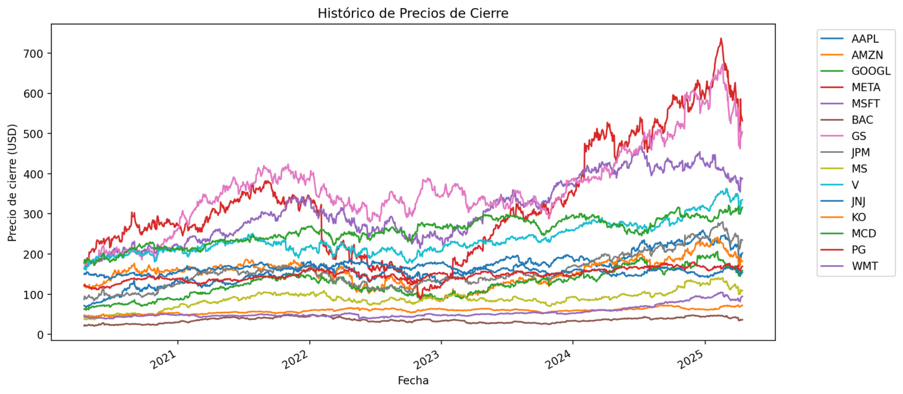
  
- Rentabilidad simple acumulativa (Fig 2.)
  
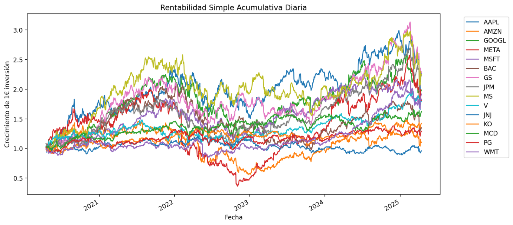
 
- Histograma de retornos (Fig 3.)
  
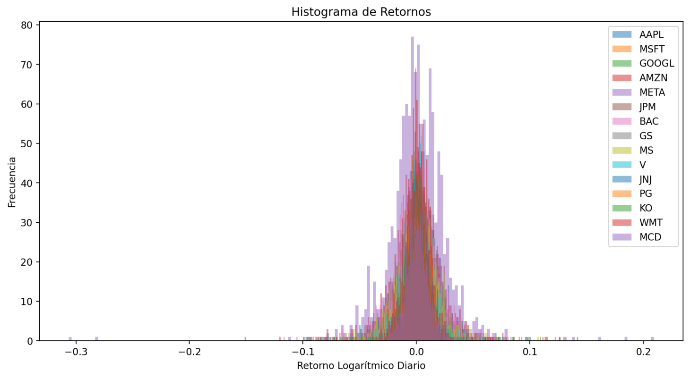
 
- Análisis de volatilidad (Fig 4.)

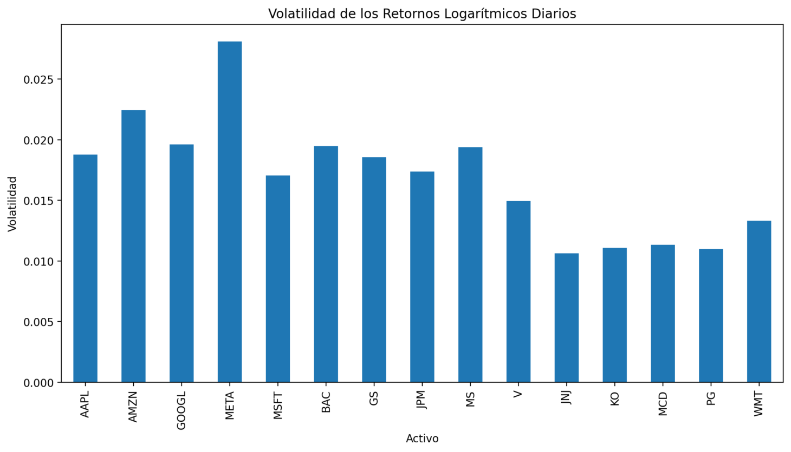
  
- Volatilidad de la rentabilidad (Fig 5.)

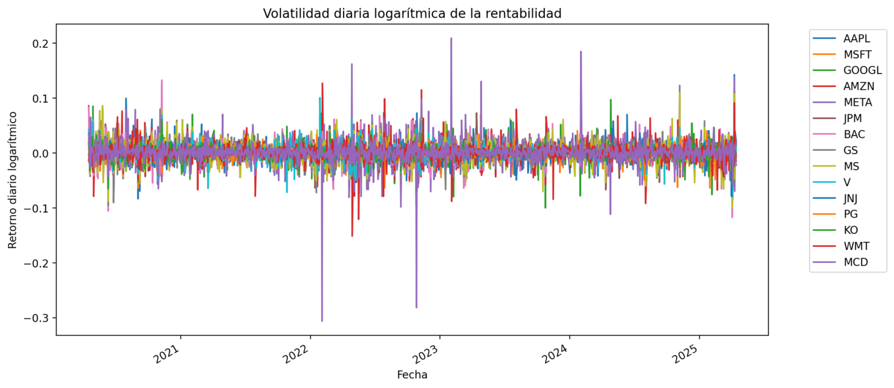
  
-  Matriz de correlación (Fig 6.)
  
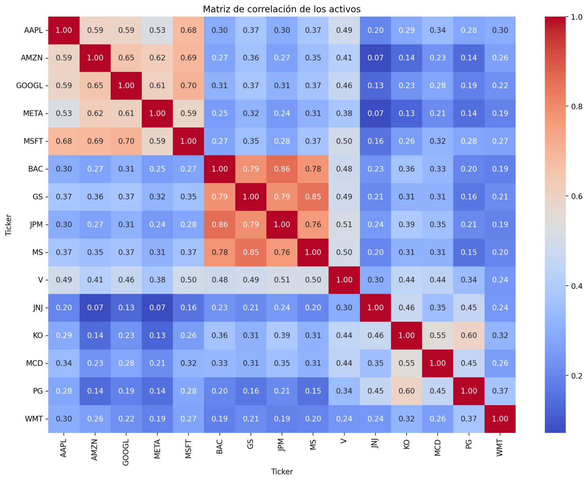
  
- Simulación de Monte Carlo (Fig 7.)

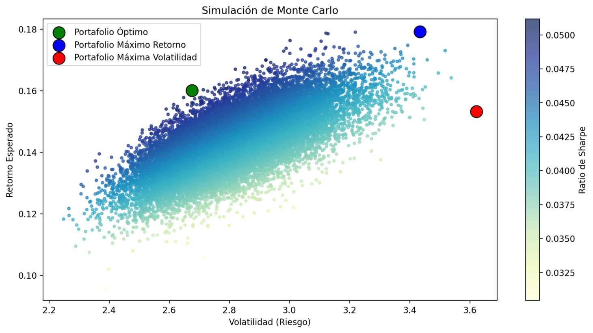

- Distribución del portafolio óptimo (Fig 8.)

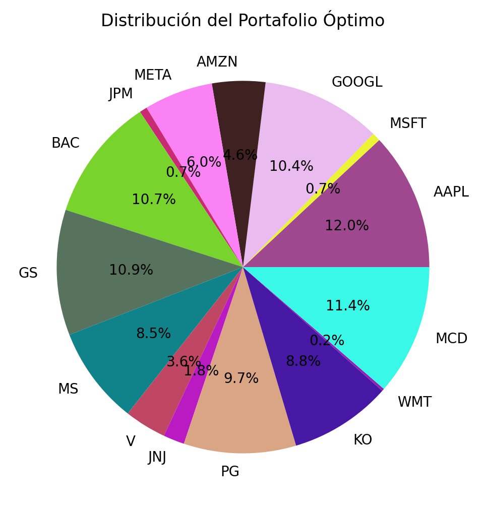

- Distribución del valor en euros (Fig 8A.)

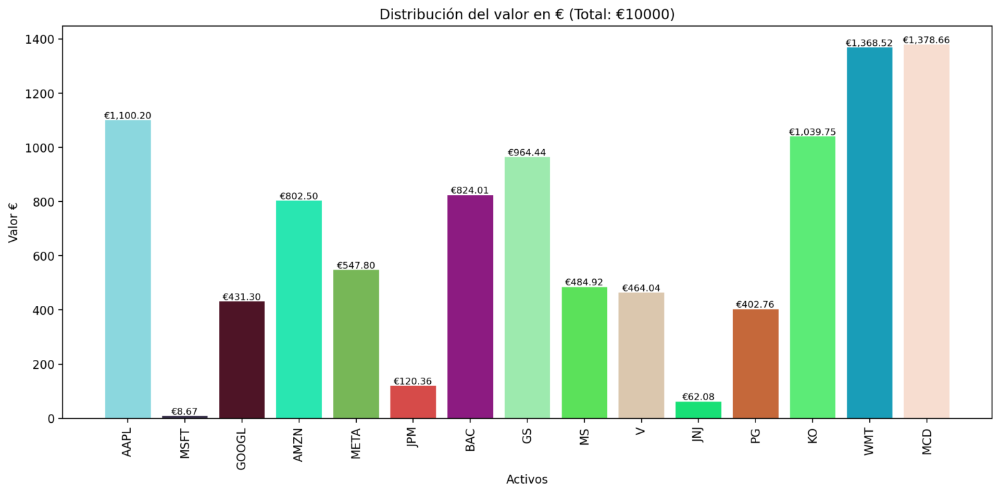

- Comparación con benchmark (Fig 11.)

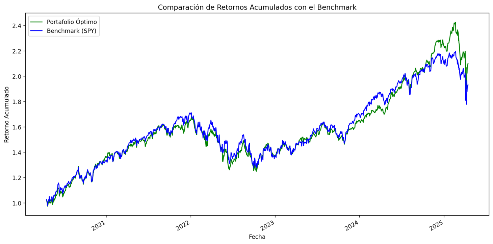

- Análisis de sensibilidad (Fig 12.)

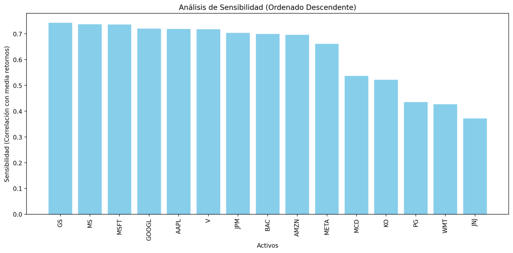

- Análisis de escenarios (Fig 13.)

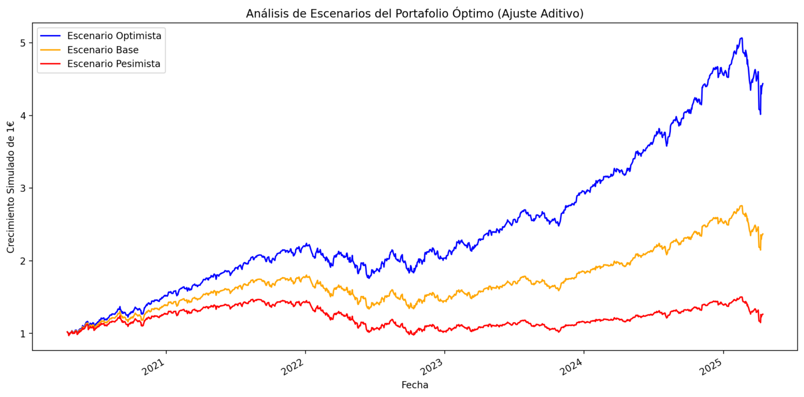


## Estructura del Proyecto

```
porfolio-analysis/
├── assets/                   # Carpeta para recursos
│   ├── logo.png              # Icono de la aplicación (copyright)
│   └── Fig.png
├── streamlit_portfolio_v9.py # Script principal de la aplicación
├── requirements.txt          # Dependencias de Python
└── README.md                 # Este archivo

```

## Notas

- La aplicación utiliza datos de Yahoo Finance para obtener precios históricos
- Se recomienda usar símbolos válidos de Yahoo Finance
- El análisis se realiza sobre datos históricos y no constituye asesoramiento financiero
- Los resultados son para fines educativos y de investigación

## Contribuciones

Las contribuciones son bienvenidas. Por favor, abre un issue primero para discutir los cambios que te gustaría realizar.

## Licencia

Este proyecto está bajo la Licencia Apache-2.0 - ver el archivo LICENSE para más detalles.

## Autor

codi-web

## Versión

- v9.1.1
- V9.1.2 : Las figuras o imágenes y algunos cálculos o fórmulas han cambiado en la version 9.1.2.
